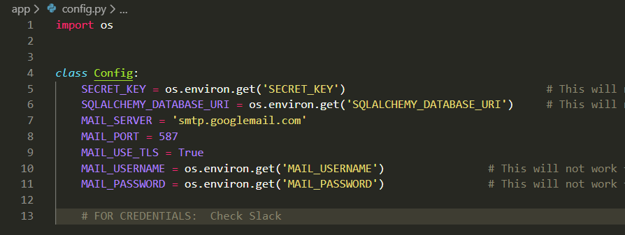

# CodeHub

# CSC-32200-Software-Engineering
CSC-32200-Software-Engineering Spring 2020 @ The City College of New York 

Okay listen up team! Read these instructions very carefully:

# The file Structure for CodeHub is as follows:

``` 
.
├── app
│   ├── blueprint_imports.txt
│   ├── config.py
│   ├── database.db
│   ├── errors
│   │   ├── handlers.py
│   │   └── __init__.py
│   ├── __init__.py
│   ├── main
│   │   ├── __init__.py
│   │   └── routes.py
│   ├── models.py
│   ├── posts
│   │   ├── forms.py
│   │   ├── __init__.py
│   │   └── routes.py
│   ├── static
│   │   ├── main.css
│   │   └── profile_images
│   │       ├── 53fa8c80cb8f07d2.jpg
│   │       ├── 73933dcf6ece5589.jpg
│   │       ├── a41e8879cea4dba5.png
│   │       ├── b169d1fe59e8b623.png
│   │       ├── b57c997a27cb7a5e.png
│   │       ├── b82418344831a769.jpg
│   │       ├── default.jpg
│   │       ├── e7abcd9c7d0f3682.jpg
│   │       ├── ed281b648c3e8981.jpg
│   │       └── edb7154b333427af.jpg
│   ├── templates
│   │   ├── about.html
│   │   ├── account.html
│   │   ├── create_post.html
│   │   ├── errors
│   │   │   ├── 403.html
│   │   │   ├── 404.html
│   │   │   └── 500.html
│   │   ├── home.html
│   │   ├── login.html
│   │   ├── post.html
│   │   ├── register.html
│   │   ├── reset_request.html
│   │   ├── reset_token.html
│   │   ├── template.html
│   │   └── user_posts.html
│   └── users
│       ├── forms.py
│       ├── __init__.py
│       ├── routes.py
│       └── utils.py
├── README.md
└── run.py

```

# Recommended Text Editor: 
- Microsoft <a href="https://code.visualstudio.com/download">VSCode</a>

Once you have VSCode installed and running, with the cloned repository folder open. 

To open a terminal press <b>(ctrl + ~)</b> (tilda it's below the esc key). 

### The recommended Terminal is either: 
- <a href="https://www.microsoft.com/en-us/p/ubuntu/9nblggh4msv6?activetab=pivot:overviewtab"> WSL Ubuntu </a> -- bash
- Ubuntu Terminal Extension for VSCode. 

To install the Ubuntu Terminal extension for VSCode: press <b>(ctrl + shift + x)</b> to get the extension store, and then search for Ubuntu, and click the green install button when prompted. 

An issue with Ubuntu terminal is that you can't set this terminal as a default terminal VScode at the moment, the only way to open this terminal and create more instances of it is to press <b>(ctrl + alt + u)</b>.

# Development Enviornment Set up:
To clone this repository enter the following command: 

    $ git clone https://github.com/rehman000/CodeHub/

#### Information about the environment variables
The following enviornmental variables are located in: <b>CodeHub/app/config.py</b>

* SQLALCHEMY_DATABASE_URI represents the url to an SQL database
* SECRET_KEY represents your secret key
* MAIL_USERNAME represents an email address
* MAIL_PASSWORD represents an email password



For testing purposes you can insert the following: 

```
export SECRET_KEY="Todd_Howard_Strikes_Again"
export SQLALCHEMY_DATABASE_URI="sqlite:///database.db"
export MAIL_USERNAME="dummyEmail@gmail.com"
export MAIL_PASSWORD="dummyPassword"
```

But you will need to provide your <b>actual email address</b>, and an <b>actual password</b>, for convenience you can insert this on to the bottom of the .bash_profile file in WSL/Ubuntu, and then run the following command:  

        $ source .bash_profile

so that these changes take effect. Now that the enviornment variables have been set, all that's left is to install all the dependencies, and run the application. 

- If that seems too complicated or confusing for testing purposes you can insert these values directly into config.py, However <b>DO NOT COMMIT</b> these changes, they have private information <b>(such as your email address and password)</b> that will be available as <b>plain text</b> in the git log for this <b>public</b> repository. 

# Installing Dependencies: 

    $ pip3 install -r requirements.txt
    
Note if you get any error stating no module named "module name", you just need to install that dependency:

    $ pip3 install "module name"

# Running the Application:

Now that we have everything set up properly to run the application enter the following command:

    $ python3 run.py

The application will be running on:     http://localhost:5000/ 
